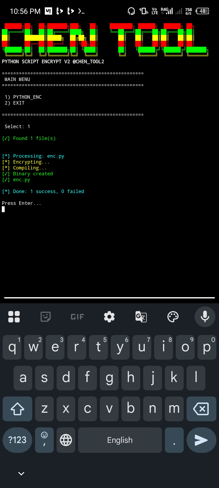

# 🔥 ELF+ ENCRYPTER v2.0 – SECURE PYTHON ENCRYPTER 🔥

<div align="center">

[](https://github.com/CHEN_TOOL2)
[](https://python.org)
[](LICENSE)
[]()

</div>

---

## 📸 SCREENSHOT

<div align="center">
  


</div>

---

## 🛡️ FEATURES – ULTIMATE PROTECTION SYSTEM

| 🔐 Protection Layer | 📝 Description |
|-------------------|----------------|
| ✅ **Advanced Protection System** | Military-grade encryption |
| ✅ **Anti-Crack Security** | Prevents reverse engineering |
| ✅ **String Obfuscation** | Hides all readable strings |
| ✅ **Anti-Static Analysis** | Blocks disassembly tools |
| ✅ **Anti-Debugging** | Detects & blocks debuggers |
| ✅ **Anti-VPN Detection** | Blocks proxy/VPN connections |
| ✅ **Anti-Frida Protection** | Defeats dynamic instrumentation |
| ✅ **Device Lock Security** | Locks to specific device ID 🔒 |

---

## 📁 SUPPORTED INPUTS

```

✅ Cython Compiled Binaries (.so / .pyd)
✅ Python Files (.py)
✅ ELF Executables (after compilation)

```

---

## ⚙️ INSTALLATION COMMANDS

Copy & paste these into **Termux** or any Linux terminal:

```bash
pkg update -y && pkg upgrade -y
pkg install -y python clang binutils make pkg-config libffi openssl
pip install --upgrade pip
pip install requests cython pyarmor
```

---

📂 DEFAULT WORKING DIRECTORY

```
/storage/emulated/0/Download/PYTHON_ENC/
```

💡 Place your .py or .so files inside this folder before encryption.

---

🚀 HOW TO RUN THE TOOL

```bash
cd PYTHON_ENC
chmod +x *
./enc
```

---

🎮 MAIN MENU PREVIEW

```
==========================================
MAIN MENU
==========================================
1) PYTHON_ENC
2) EXIT
==========================================
Select: 1

[✓] Found 1 file(s)
[*] Processing: enc.py
[*] Encrypting...
[*] Compiling...
[✓] Binary created
[✓] enc.py
[*] Done: 1 success, 0 failed
```

---

🔑 LICENSE

```
✅ KEY : LIFETIME FREE
🆓 No payment – ever.
```

---

📢 JOIN OUR COMMUNITY

Platform Link
▶️ YouTube @4am-chen
📡 Telegram Join Channel
💬 DM Owner @CHEN_TOOL2™

---

⚠️ DISCLAIMER

This tool is for educational & authorized security testing only.
Do not use on code you do not own.
Author is not responsible for any misuse.

---

<div align="center">

💯 High-Level Security | Powerful Encryption 🔒

🔥 ELF+ VERSION v2.0 🔥

⭐ Star this repo if you found it useful ⭐

</div>
- ```